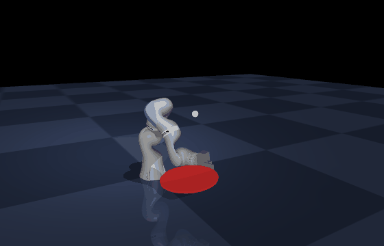
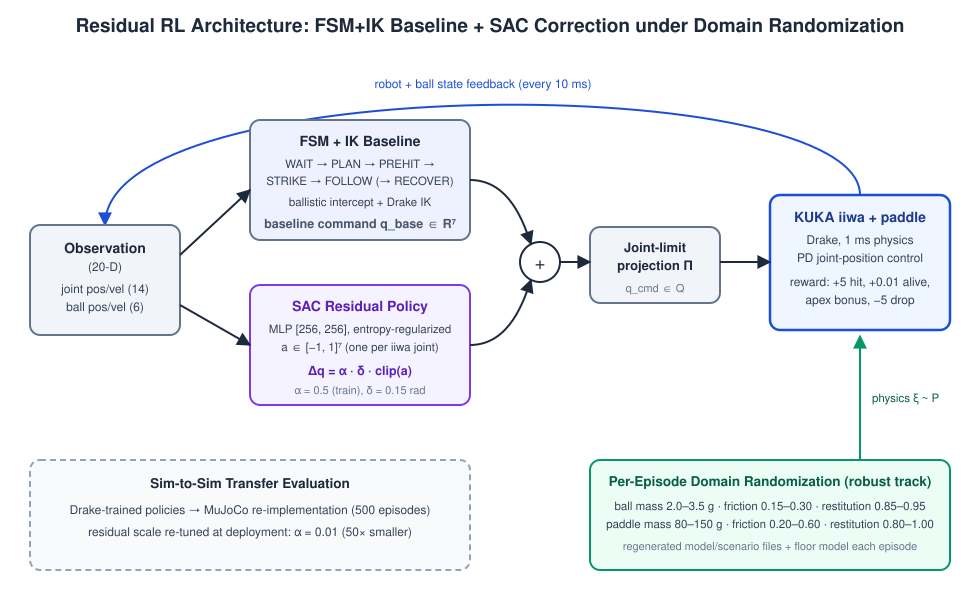
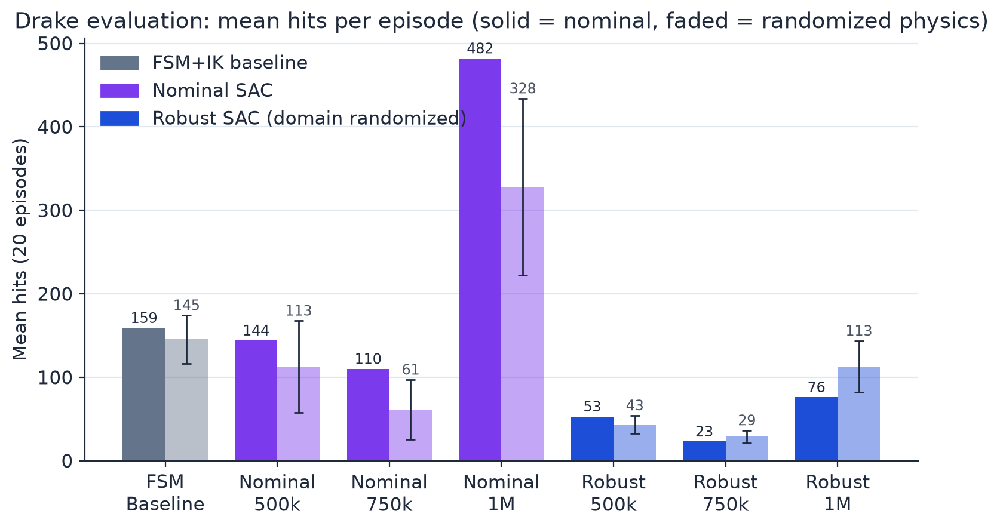
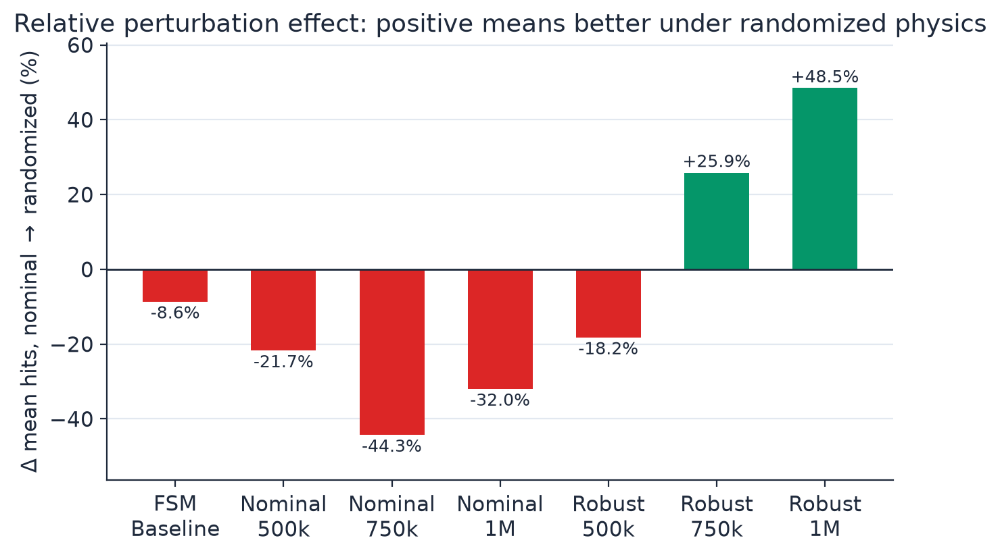
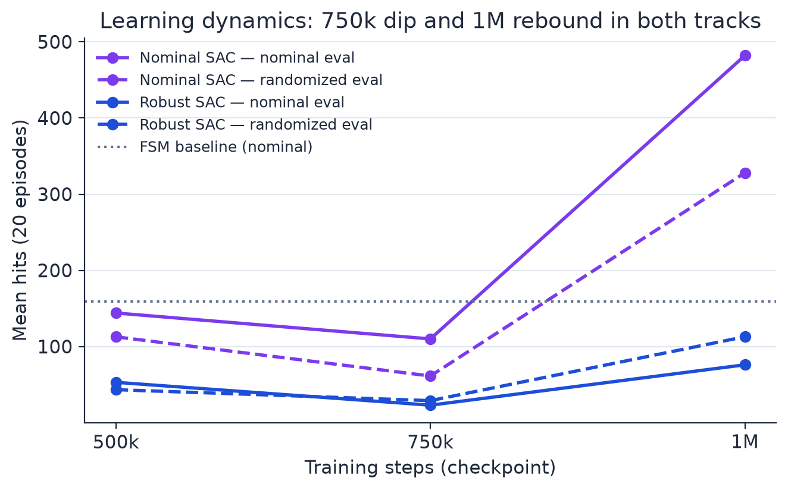
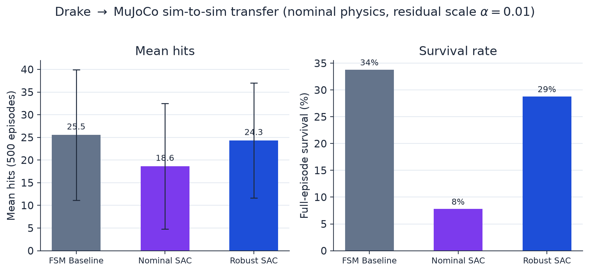
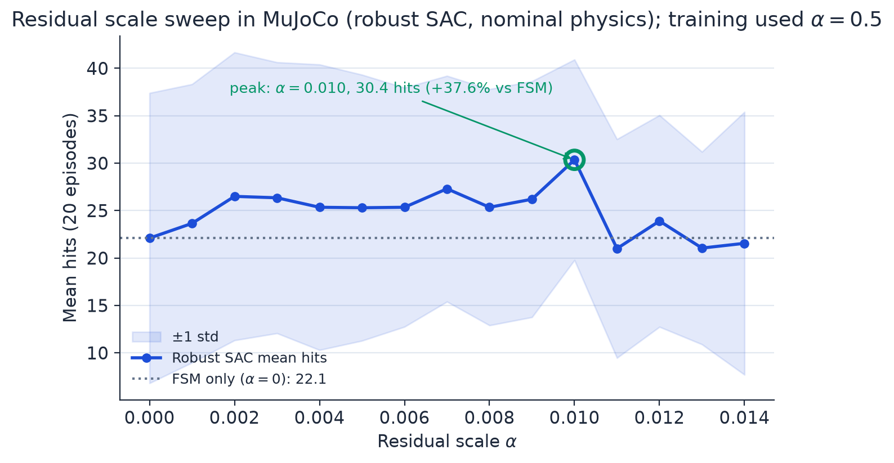

# Robot Ping-Pong Control Under Physics Variation
### Domain Randomization and Residual Reinforcement Learning

**Mayand Gulati · Julia Novick · Jonathan Zhang · Sagnik Biswas** \
UC Santa Barbara — CS 291K: Robot Learning

<p align="center">
  
</p>
<p align="center">
  <em>The FSM+IK baseline controller bouncing the ball in the MuJoCo transfer environment
  (nominal physics, deterministic initialization, 37 hits in 12&nbsp;s).</em>
</p>

---

## Abstract

We study residual reinforcement learning for robotic ball bouncing under simulation physics uncertainty. The controller combines a finite-state-machine and inverse-kinematics baseline (**FSM+IK**) with a learned Soft Actor-Critic (**SAC**) residual that provides bounded joint-space corrections on a 7-DOF KUKA iiwa. We compare **nominal** SAC training on fixed physics against **robust** SAC training with per-episode domain randomization over mass, friction, and restitution parameters.

In the Drake training simulator, nominal SAC achieves the strongest absolute performance (**482 mean hits** under nominal physics — about 3× the FSM baseline's 159 — and 328 under randomized physics), while robust SAC exhibits better *relative* robustness at later checkpoints (**+25.9 %** at 750k and **+48.5 %** at 1M going from nominal to randomized evaluation) and much lower variance under perturbation (σ = 30.9 vs. 106). In nominal-physics MuJoCo sim-to-sim transfer, all policies degrade relative to Drake; the FSM baseline slightly outperforms robust SAC, while robust SAC remains close and outperforms nominal SAC. A residual-scale sweep shows a narrow optimal injection magnitude (α ≈ 0.01, 50× smaller than the training value of 0.5) that improves over pure FSM by **37.6 %** in MuJoCo.

## System Architecture

<p align="center">
  
</p>

At every 10 ms control step (physics runs at 1 ms):

1. The **FSM+IK baseline** (WAIT → PLAN → PREHIT → STRIKE → FOLLOW-THROUGH, with RECOVER on failure) predicts a ballistic intercept and solves Drake IK for prehit/hit/follow-through waypoints, producing the baseline command `q_base ∈ ℝ⁷`.
2. The **SAC residual policy** (MLP [256, 256]) maps the 20-D observation (7 joint positions, 7 joint velocities, ball position, ball velocity) to a normalized action `a ∈ [−1, 1]⁷`.
3. The commanded joint position is
   `q_cmd = Π_Q( q_base + α · δ · clip(a, −1, 1) )`
   with residual scale α = 0.5 during training, maximum residual δ = 0.15 rad per joint, and Π_Q the projection onto the joint-limit set — so the residual can never violate joint-position constraints (proved in the paper appendix).

**Reward.** +5.0 per debounced paddle-ball hit, +0.01 alive bonus per step (ball above 0.08 m), a Gaussian apex-tracking bonus around a 0.55 m target apex, and −5.0 when the ball drops (which terminates the episode).

**Domain randomization (robust track).** Each robust-training episode samples physics uniformly and regenerates the simulator model/scenario files (including the floor model):

| Parameter | Min | Max |
|---|---|---|
| Ball mass (kg) | 0.0020 | 0.0035 |
| Ball friction | 0.15 | 0.30 |
| Ball restitution | 0.85 | 0.95 |
| Paddle mass (kg) | 0.08 | 0.15 |
| Paddle friction | 0.20 | 0.60 |
| Paddle restitution | 0.80 | 1.00 |

## Results

### 1. Drake evaluation (20 deterministic episodes per cell)

| Model | Eval physics | Mean hits | Std | Max | Mean sim time (s) | Δ vs nominal |
|---|---|---:|---:|---:|---:|---:|
| FSM Baseline | Nominal | 159.0 | 0.0 | 159 | 20.0 | — |
| FSM Baseline | Randomized | 145.3 | 29.0 | 189 | 17.7 | −8.6 % |
| Nominal SAC 500k | Nominal | 144.0 | 0.0 | 144 | 11.0 | — |
| Nominal SAC 500k | Randomized | 112.8 | 55.1 | 274 | 8.5 | −21.7 % |
| Nominal SAC 750k | Nominal | 110.0 | 0.0 | 110 | 6.6 | — |
| Nominal SAC 750k | Randomized | 61.3 | 35.9 | 156 | 3.9 | −44.3 % |
| **Nominal SAC 1M** | Nominal | **482.0** | 0.0 | **482** | 20.0 | — |
| **Nominal SAC 1M** | Randomized | **328.0** | 106.0 | 474 | 13.9 | −32.0 % |
| Robust SAC 500k | Nominal | 53.0 | 0.0 | 53 | 3.5 | — |
| Robust SAC 500k | Randomized | 43.4 | 11.0 | 66 | 2.8 | −18.2 % |
| Robust SAC 750k | Nominal | 23.0 | 0.0 | 23 | 1.7 | — |
| Robust SAC 750k | Randomized | 29.0 | 7.5 | 51 | 1.8 | **+25.9 %** |
| Robust SAC 1M | Nominal | 76.0 | 0.0 | 76 | 1.7 | — |
| Robust SAC 1M | Randomized | 112.9 | 30.9 | 181 | 2.7 | **+48.5 %** |

<p align="center">
  
</p>

**Key findings**

- **Absolute performance:** Nominal SAC at 1M reaches 482 mean hits under nominal physics — a ~3× improvement over the FSM baseline (159).
- **Relative robustness:** Robust SAC turns *positive* in Δ at later checkpoints (+25.9 % at 750k, +48.5 % at 1M): it performs better under randomized physics than under nominal.
- **Consistency:** Under randomized physics, robust SAC 1M has ~3.5× lower variance than nominal SAC 1M (σ = 30.9 vs. 106).
- **Learning dynamics:** Both tracks show a 750k dip and a 1M rebound, consistent with value-function reorganization under mixed sparse/dense rewards and contact discontinuities.

<p align="center">
  
</p>
<p align="center">
  
</p>

Note the quantity/duration distinction: robust policies can produce short episodes with very high instantaneous hit throughput (robust 1M: ~45 hits/s vs. nominal 1M: ~24 hits/s), so high hit count and long survival are related but not identical objectives here.

### 2. Drake → MuJoCo sim-to-sim transfer (500 episodes per model, nominal physics, α = 0.01)

| Model | Mean hits | Std | Survival |
|---|---:|---:|---:|
| FSM Baseline | 25.5 | 14.4 | 34 % |
| Nominal SAC | 18.6 | 13.9 | 8 % |
| Robust SAC | 24.3 | 12.7 | 29 % |

<p align="center">
  
</p>

All models drop substantially relative to Drake, showing that sim-to-sim transfer is hard even with preserved nominal geometry. The FSM baseline slightly outperforms robust SAC; robust SAC stays close and clearly outperforms nominal SAC, whose survival rate collapses to 8 %.

### 3. Residual scale must be recalibrated at deployment

Sweeping the residual scale α for robust SAC in MuJoCo (15 values in [0, 0.014], 20 episodes each, nominal physics):

<p align="center">
  
</p>

- Peak performance at **α = 0.01**: 30.4 mean hits, **+37.6 %** over pure FSM (α = 0, 22.1 hits), with std reduced from 15.3 to 10.6.
- The optimum is **50× smaller** than the training-time α = 0.5 — corrections tuned for Drake contacts need strong damping in MuJoCo; larger α actively degrades the baseline.
- Practical takeaway: for a new simulator (or real hardware), tune α at deployment with a small grid search rather than copying the training value.

## Limitations / Threats to Validity

- Single-seed training; uncertainty across initializations is not fully characterized.
- Deterministic nominal evaluation yields near-zero nominal std, limiting uncertainty reporting (randomized evaluation and variance metrics partially recover it).
- Simulation-only conclusions; no hardware validation yet.
- Hit counting (force-thresholded, 100 ms debounce, ball above 0.20 m) and horizon settings influence rankings.
- The optimal deployment residual scale is transfer-sensitive (0.01 in MuJoCo vs. 0.5 in training).

## Repository Structure

```
├── final_paper_v2.tex        # Full paper (LaTeX source)
├── configs/scenarios/        # Drake scenario YAML (+ Jinja template for randomization)
├── models/                   # Ball/paddle/floor models (+ Jinja) and trained SAC policies
│   ├── sac_nominal_1m/       #   nominal-track checkpoints (500k/750k) + final
│   ├── sac_robust_1m/        #   robust-track checkpoints (500k/750k) + final
│   ├── sac_nominal_final_mujoco_eval.zip   # nominal policy used in MuJoCo evals
│   └── sac_robust_final_mujoco_eval.zip    # robust policy used in MuJoCo evals
├── src/
│   ├── controllers/          # FSM+IK baseline (fsm_controller.py)
│   ├── envs/                 # Drake residual RL environment (residual_env.py)
│   ├── utils/randomization.py# Domain randomization (writes randomized model files)
│   ├── train_rl.py           # SAC training entry point
│   └── evaluate.py           # Deterministic 20-episode evaluation
├── mujoco_transfer/          # MuJoCo re-implementation for sim-to-sim transfer
│   ├── fsm_ik_env.py         #   FSM+IK running under MuJoCo dynamics
│   ├── residual_env_mujoco.py#   residual policy evaluation env
│   ├── run_mujoco_eval_protocol.py  # 500-episode evaluation protocol
│   └── tune_robust_residual_scale.py# residual scale sweep
├── scripts/                  # Simulation, training, and evaluation drivers
├── results/                  # Evaluation artifacts backing every number above
└── tests/
```

## Getting Started

```bash
python3 -m venv .venv && source .venv/bin/activate
pip install -r requirements.txt
```

Watch the baseline controller in Drake (Meshcat visualizer):

```bash
./scripts/run_sim.sh --meshcat
```

### Reproducing the paper

```bash
# Train both tracks (1M steps each)
python -m src.train_rl --steps 1000000 --no-randomize --save-path data/sac_nominal_1m --seed 42
python -m src.train_rl --steps 1000000 --randomize    --save-path data/sac_robust_1m  --seed 42

# Drake evaluation matrix (Table 1) and final figures
python scripts/run_all_evals.py
python results/generate_final_report.py

# MuJoCo sim-to-sim transfer (500-episode protocol) and residual scale sweep
python -m mujoco_transfer.run_mujoco_eval_protocol
python -m mujoco_transfer.tune_robust_residual_scale
```

### Data provenance

Every number in this README (and the paper) is auditable from repository artifacts:

- `results/all_eval_results.json` — Drake 20-episode evaluation matrix
- `results/fsm_baseline_report.md`, `results/rl_training_report.md` — dedicated reports
- `results/mujoco_table2_nominal_dataset.json`, `results/mujoco_eval_protocol_*/` — 500-episode MuJoCo evaluations
- `results/residual_scale_tuning/` — residual scale sweep data
- `results/final_*.png` — figures used in the paper

Key references: SAC ([Haarnoja et al., 2018](https://arxiv.org/abs/1801.01290)), domain randomization ([Tobin et al., 2017](https://arxiv.org/abs/1703.06907); [Peng et al., 2018](https://arxiv.org/abs/1710.06537)), residual RL ([Johannink et al., 2019](https://arxiv.org/abs/1812.03201)), Stable-Baselines3 ([Raffin et al., 2021](https://github.com/DLR-RM/stable-baselines3)). The full bibliography is in [final_paper_v2.tex](final_paper_v2.tex).
