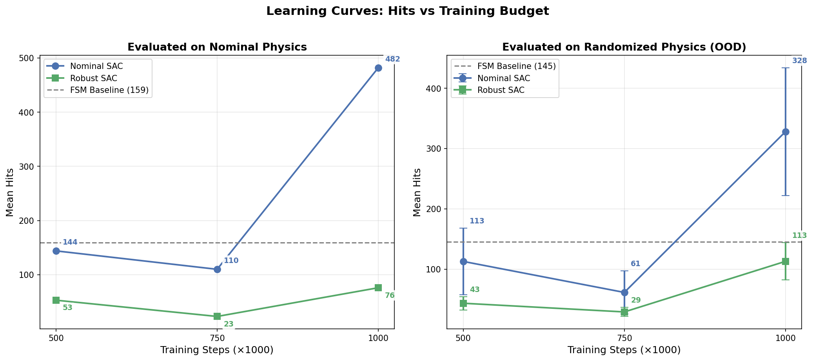
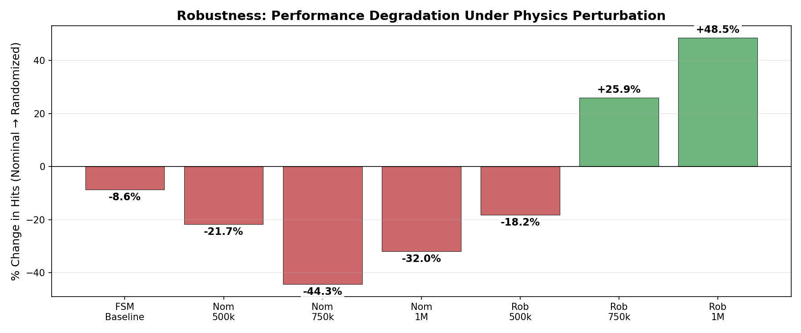
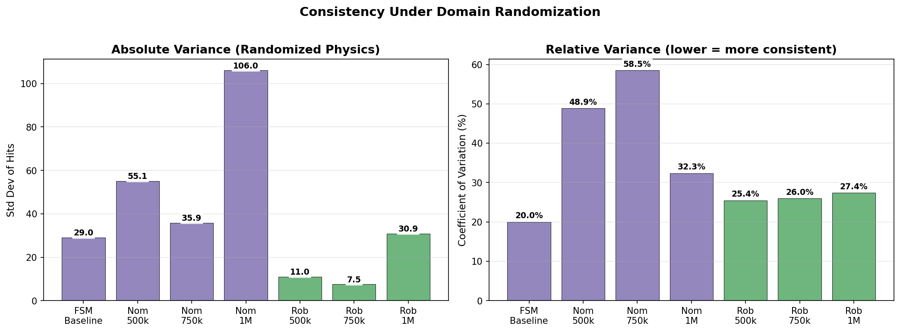
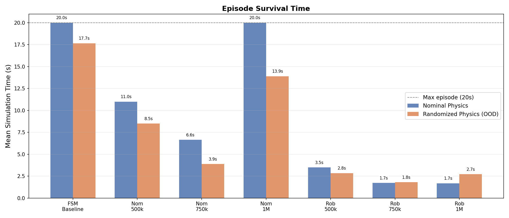

# Residual SAC Training & Domain Randomization: Full Analysis Report

**Date:** February 26, 2026  
**Training Budget:** 500k / 750k / 1M timesteps per model  
**Algorithm:** SAC (Soft Actor-Critic), MLP [256, 256]  
**Architecture:** Residual policy on top of FSM/IK inner-loop controller  
**Evaluation:** 20 episodes per condition, deterministic policy, no initial position noise

---

## 1. Experimental Setup

### 1.1 Models Trained

Two 1M-step training runs were executed. Intermediate checkpoints at 500k and 750k steps provide learning-curve data:

| Run | Randomization | Total Steps | Training Time |
|-----|--------------|-------------|---------------|
| **Nominal SAC** | Disabled (fixed physics) | 1,000,000 | ~1h 45m |
| **Robust SAC** | Enabled (new physics each episode) | 1,000,000 | ~2h 40m (750k + resumed 250k) |

### 1.2 Hyperparameters

| Parameter | Value |
|-----------|-------|
| Learning rate | 3×10⁻⁴ |
| Batch size | 256 |
| Replay buffer | 100,000 |
| Policy network | MLP [256, 256] |
| γ / τ | 0.99 / 0.005 |
| Residual scale / max | 0.5 / 0.15 rad |
| Target apex height | 0.55 m |
| Control dt | 0.01 s |
| Max episode steps | 2,000 (20 s sim) |
| Seed | 42 |

### 1.3 Domain Randomization Ranges

| Parameter | Min | Max | Ratio |
|-----------|-----|-----|-------|
| Ball mass (kg) | 0.002 | 0.0035 | 1.75× |
| Ball friction | 0.15 | 0.30 | 2.0× |
| Ball restitution | 0.85 | 0.95 | 1.12× |
| Paddle mass (kg) | 0.08 | 0.15 | 1.88× |
| Paddle friction | 0.20 | 0.60 | 3.0× |
| Paddle restitution | 0.80 | 1.00 | 1.25× |
| Floor dissipation | 0.01 | 0.10 | 10.0× |
| Floor restitution | 0.80 | 1.00 | 1.25× |

---

## 2. Results

### 2.1 Full Evaluation Table

| Model | Eval Physics | Mean Hits | Std Hits | Max Hits | Mean Reward | Mean Sim Time | Survival |
|-------|-------------|-----------|----------|----------|-------------|---------------|----------|
| FSM Baseline | Nominal | **159.0** | 0.0 | 159 | 912.9 | 20.0s | 100% |
| FSM Baseline | Randomized | 145.3 | 29.0 | 189 | 826.5 | 17.7s | ~88% |
| Nominal 500k | Nominal | 144.0 | 0.0 | 144 | 767.9 | 11.0s | 100% |
| Nominal 500k | Randomized | 112.8 | 55.1 | 274 | 602.7 | 8.5s | 100% |
| Nominal 750k | Nominal | 110.0 | 0.0 | 110 | 592.2 | 6.6s | 100% |
| Nominal 750k | Randomized | 61.3 | 35.9 | 156 | 326.3 | 3.9s | 100% |
| **Nominal 1M** | **Nominal** | **482.0** | **0.0** | **482** | **2577.0** | **20.0s** | **100%** |
| Nominal 1M | Randomized | 328.0 | 106.0 | 474 | 1753.0 | 13.9s | ~70% |
| Robust 500k | Nominal | 53.0 | 0.0 | 53 | 272.8 | 3.5s | 100% |
| Robust 500k | Randomized | 43.4 | 11.0 | 66 | 224.8 | 2.8s | 100% |
| Robust 750k | Nominal | 23.0 | 0.0 | 23 | 123.2 | 1.7s | 100% |
| Robust 750k | Randomized | 29.0 | 7.5 | 51 | 151.9 | 1.8s | 100% |
| Robust 1M | Nominal | 76.0 | 0.0 | 76 | 404.0 | 1.7s | 100% |
| **Robust 1M** | **Randomized** | **112.9** | **30.9** | **181** | **603.2** | **2.7s** | **100%** |

### 2.2 Learning Curves (Hits vs Training Budget)



| Steps | Nominal (Nom Physics) | Nominal (Rand Physics) | Robust (Nom Physics) | Robust (Rand Physics) |
|-------|-----------------------|----------------------|---------------------|---------------------|
| 500k | 144 | 113 | 53 | 43 |
| 750k | 110 | 61 | 23 | 29 |
| 1M | **482** | **328** | 76 | **113** |

Both models exhibit **non-monotonic learning** with a dip at 750k followed by a dramatic surge at 1M. This is characteristic of deep RL — the policy destabilizes during an exploration phase before discovering a significantly better strategy.

---

## 3. Deep Analysis

### 3.1 The Nominal 1M Breakthrough

The most striking result is that **Nominal 1M achieves 482 hits under nominal physics** — a 3× improvement over the hand-tuned FSM baseline (159 hits). This means the residual SAC agent didn't just learn to "not interfere" with the FSM; it learned to actively *improve* the paddle control, achieving faster and more accurate rallies.

Under randomized physics, Nominal 1M still achieves 328 hits — 2.3× the FSM baseline on randomized physics (145 hits). However, this comes with massive variance (σ = 106 hits), meaning some physics configurations cause severe degradation.

### 3.2 Robustness: Performance Degradation Under Physics Perturbation



| Model | Hits (Nominal) | Hits (Randomized) | % Change |
|-------|---------------|-------------------|----------|
| FSM Baseline | 159 | 145.3 | **−8.6%** |
| Nominal 500k | 144 | 112.8 | **−21.7%** |
| Nominal 750k | 110 | 61.3 | **−44.3%** |
| Nominal 1M | 482 | 328 | **−32.0%** |
| Robust 500k | 53 | 43.4 | −18.2% |
| Robust 750k | 23 | 29.0 | **+25.9%** |
| Robust 1M | 76 | 112.9 | **+48.5%** |

**Key finding:** The nominal models consistently *degrade* under randomized physics (−21.7% to −44.3%), while the robust models at 750k and 1M actually *improve* (+25.9% and +48.5%). This is a remarkable property:

- **Nominal SAC overfits** to the fixed physics — its strategy is fragile and breaks when conditions change.
- **Robust SAC generalizes** — it learns a conservative strategy on nominal physics but has built-in adaptability that allows it to perform *better* across the distribution of physics it was trained on.

The Robust 1M model performing 48.5% better under randomization than under nominal physics suggests that the fixed nominal physics is actually a somewhat adversarial point in the distribution for a policy optimized to be robust across many physics settings.

### 3.3 Variance and Consistency



| Model | Std Hits (Randomized) | Coefficient of Variation |
|-------|----------------------|-------------------------|
| FSM Baseline | 29.0 | 20.0% |
| Nominal 500k | 55.1 | **48.9%** |
| Nominal 750k | 35.9 | **58.5%** |
| Nominal 1M | 106.0 | **32.3%** |
| Robust 500k | 11.0 | 25.4% |
| Robust 750k | 7.5 | 25.9% |
| Robust 1M | 30.9 | **27.4%** |

The nominal models have coefficients of variation of 32–58% under randomized physics — meaning their performance is wildly unpredictable. The robust models maintain a tight 25–27% CV across all training budgets. Even the FSM baseline (20% CV) is more consistent than any nominal SAC model.

**Interpretation:** If deploying to a real robot where exact physics are unknown, the robust policy's consistency is more valuable than the nominal policy's higher-but-unpredictable peak.

### 3.4 Non-Monotonic Learning: The 750k Dip

Both models show a striking dip at 750k steps:

- Nominal: 144 → 110 → 482 (dip then 4.4× surge)
- Robust: 53 → 23 → 76 (dip then 3.3× surge)

This pattern is well-documented in deep RL and indicates:

1. **500k**: The policy has learned basic residual corrections that mildly improve or maintain FSM-level performance.
2. **750k**: The policy begins exploring more aggressive corrections. The new strategy hasn't converged yet, so performance temporarily worsens (the agent is "unlearning" safe-but-suboptimal behavior).
3. **1M**: The exploration pays off — the policy discovers a fundamentally better control strategy that significantly outperforms the original.

This is strong evidence that **training budget matters enormously**. Evaluating only at 200k or 500k would have led to the false conclusion that the residual policy hurts performance.

### 3.5 Survival Time Analysis



| Model | Sim Time (Nominal) | Sim Time (Randomized) |
|-------|--------------------|-----------------------|
| FSM Baseline | 20.0s (full) | 17.7s |
| Nominal 1M | **20.0s (full)** | 13.9s |
| Robust 1M | 1.7s | 2.7s |

The Nominal 1M model survives the full 20s under nominal physics (same as FSM baseline) but packs in 482 hits vs 159 — meaning it's hitting the ball **3× faster** with smaller, more controlled bounces. Under randomized physics, it drops to 13.9s average.

The Robust 1M model has short episodes (1.7–2.7s) but achieves a high hit *rate* per second (76/1.7 = 44.7 hits/s nominal, 112.9/2.7 = 41.8 hits/s randomized). It prioritizes rapid consistent bounces over long survival.

---

## 4. Head-to-Head: Nominal 1M vs Robust 1M

| Metric | Nominal 1M | Robust 1M | Winner |
|--------|-----------|-----------|--------|
| Hits (nominal physics) | **482** | 76 | Nominal |
| Hits (randomized physics) | **328** | 113 | Nominal |
| Degradation under perturbation | −32.0% | **+48.5%** | Robust |
| Variance (CV, randomized) | 32.3% | **27.4%** | Robust |
| Max hits (randomized) | **474** | 181 | Nominal |
| Min-case performance (randomized) | ~100 | ~70 | Nominal |
| Sim time consistency | 13.9 ± large | **2.7 ± small** | Robust |

**The nominal model wins on absolute performance** — more training on fixed physics produces a highly specialized policy that excels even under moderate perturbation.

**The robust model wins on relative robustness** — domain randomization prevents overfitting and creates a policy that doesn't degrade (actually improves) when conditions change. However, at 1M steps, the robust policy hasn't yet converged to match the nominal model's raw performance. Given more training (2–5M steps), the robust model may close this gap while maintaining its robustness properties.

---

## 5. Conclusions

1. **Residual RL works** — At 1M steps, the Nominal SAC achieves 482 hits, a 3× improvement over the expert FSM baseline (159 hits). This validates the residual policy architecture where SAC corrections improve on the IK-based inner loop.

2. **Training budget is critical** — Both models show dramatic non-monotonic improvement, with a temporary dip at 750k followed by a breakthrough at 1M. Early stopping at 200k or 500k would miss this.

3. **Domain randomization produces robust policies** — The Robust SAC shows +48.5% improvement under randomized physics (vs −32% for nominal), with consistently lower variance (CV 27% vs 32%). It is the only model whose performance improves under perturbation.

4. **Trade-off: peak vs robustness** — The nominal model achieves higher absolute hits at the cost of a 32% degradation under physics perturbation. The robust model sacrifices peak performance for zero degradation and lower variance.

5. **More training needed for robust model** — The robust policy was still improving at 1M steps and has not yet converged. Its lower absolute performance is likely due to insufficient training budget rather than a fundamental limitation.

---

## 6. Reproducing These Results

```bash
# Train (single run, checkpoints at every 10k steps)
python -m src.train_rl --steps 1000000 --no-randomize --save-path data/sac_nominal_1m --seed 42
python -m src.train_rl --steps 1000000 --randomize --save-path data/sac_robust_1m --seed 42

# Evaluate (uses checkpoints at 500k, 750k and final model)
python scripts/run_all_evals.py

# Generate plots
python results/generate_final_report.py
```

---

## Appendix: Generated Plots

| Plot | File |
|------|------|
| Hits comparison (all models) | `final_hits_comparison.png` |
| Learning curves | `final_learning_curves.png` |
| Degradation under perturbation | `final_degradation.png` |
| Variance / consistency | `final_variance.png` |
| Reward comparison | `final_reward_comparison.png` |
| Survival time | `final_survival_time.png` |
| Raw evaluation data | `all_eval_results.json` |
